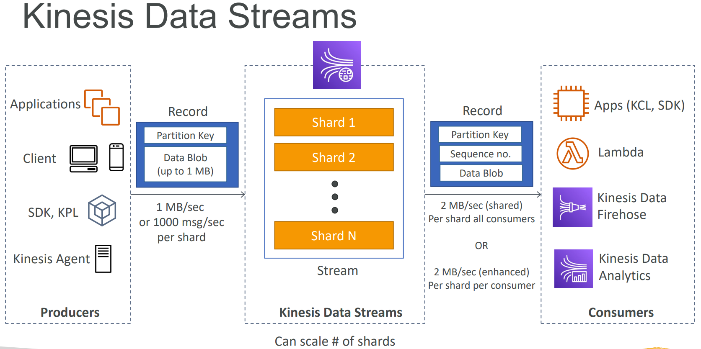

# AWS

## S3/KMS
>Can replicate new S3 bucket's object to another account's bucket in a different region. 
>KMS advantages: user control + audit key usage using CloudTrail

## REDSHIFT
-   Petabyte Scale data-warehouse service
-   Redshift Spectrum • Query exabytes of unstructured data in S3 without loading
-   During scaling: • A new cluster is created while your old one remains available for reads • CNAME is flipped to new cluster.
-   COPY can decrypt data as it is loaded from S3 • Hardware-accelerated SSL used to keep it fast.
-   Columnar based storage.
-   MPP- Massively Parallel Processing
-   Doesnt have partitions instead has something called Sort Key
-   Supports UDF in SQL/Python and not C(which is usual in traditional on-premises software)

Can we `index` all the columns in Redshift? 
No, Redshift replaces traditional indexing with:
- `Sort Keys` - Define the physical sort order of data on disk (only one per table).
- `Distribution Keys (DISTKEY)` - Control how data is distributed across cluster nodes.
- `Zone Maps` - Automatically created metadata that tracks min/max values for data blocks.
- `Columnar Storage` - Data is stored by column rather than by row, enabling efficient scanning.

— to optimize query performance in a highly parallel, columnar architecture. 
In analytical workloads, users typically scan and process large volumes of data—not just retrieve a single row or a handful of rows, as you might in transactional systems. Traditional indexes (like B-tree indexes) are designed for point lookups and rapid retrieval of individual records, which is essential for transaction processing but less critical for analytics.

#### DISTRIBUTION STYLES
| **PARAMETERS**        |    ALL	 |    EVEN	   |     KEY     |    AUTO     |
|-----------------------|------------|-------------|-------------|-------------|
| **DATA DISTRIBUTION** | All copied | Round-Robin | Based on key| Auto        |
| **DIST KEY**          | Ignored    | Ignored     | Matters     | Matters iff |

## SAM(SERVERLESS APPLICATION MODEL) (INSIDE SAM IS CF- CLOUDFORMATION)
>SAM can help you to run Lambda, API Gateway, DynamoDB locally

## LAMBDA
AWS Lambda has several important limitations related to storage, execution, and other constraints that developers need to understand when building serverless applications. Here are the key limitations:
- Storage Limitations
    - ZIP deployment package: Maximum 50 MB compressed, 250 MB uncompressed
    - Container images: Maximum 10 GB
    - Console editor: 50 MB limit for direct editing
    - Lambda layers: Maximum 50 MB per layer (uncompressed), and a function can use up to 5 layers
- Ephemeral Storage (/tmp)
    - Configurable range: 512 MB to 10,240 MB (10 GB)

## GLUE
-   Job bookmarks- Persists state from the job run.
-   LakeFormation
    -   Governed Tables and Security-that support ACID transactions across multiple tables
    -   Can’t change choice of governed afterwards.
- The minimum requirement in Glue is 2 DPUs in a Spark environment setup. However, AWS Glue can scale down to a single DPU or even 1/16 DPUs if we forego Spark and just run Glue Python scripts.

## ATHENA
-   Cross-account access in S3 bucket policy possible.
-   Highly formatted reports/visualization- that’s what QuickSight is for.
-   MSCK REPAIR TABLE
-   Athena Workgroups- organize users / teams / apps / workloads
-   Can support ACID transactions.
    -   With the use of Iceberg, another way of achieving ACID instead of Lakeformation's Governed tables.
    -   Although need to manually do compaction.
-   Can run Jupyter notebooks with Spark within Athena console.

## EMR
- Master node: manages the cluster • Tracks status of tasks, monitors cluster health.
- Core node: Hosts HDFS data and runs tasks.
- Task node: Runs tasks, does not host data • Optional • No risk of data loss when removing. 
- Spark adds 10% overhead to memory requested for drivers and executors, take this into account when setting EMR.
- Serverless
    - Scales the underlying hardware automatically, we can although give the starting point, type of nodes, but it'll think and adjust by itself.

## KDS- KINESIS DATA STREAM
<!--  No control over image size-->
 
- After a reshard(Merge or Split), read entirely from the parent until you don’t have new records.
- We don't lose data with KDF(Kinesis Data Firehose) either ends up in output or failed transformations in S3.
- KDS- Going to write custom code (producer / consumer) • Real time (~200 ms latency for classic, ~70 ms latency for enhanced fan-out) • Must manage scaling (shard splitting / merging) • Data Storage for 1 to 365 days, replay capability, multi consumers • Use with Lambda to insert data in real-time to OpenSearch (for example)
- KDF- Fully managed, send to S3, Splunk, Redshift, OpenSearch • Serverless data transformations with Lambda • Near real time • Automated Scaling • No data storage

## MIGRATION SERVICES
    DMS- Database Migration Service- Database Migration
    Datasync- To and fro AWS/On Premise- File based transfer
    AppFlow- To and fro SAAS/AWS

## EVENTBRIDGE VS STEP FUNCTION
    EventBridge or Cloudwatch Events are to schedule cron jobs or event rules to react to a service doing something
    Step Function is used to orchestrate the pipeline

## COMPLIANCE
    CloudWatch
      • Performance monitoring (metrics, CPU, network, etc…) & dashboards
      • Events & Alerting
      • Log Aggregation & Analysis
    CloudTrail
      • Record API calls made within your Account by everyone
      • Can define trails for specific resources
      • Global Service
    Config
      • Record configuration changes
      • Evaluate resources against compliance rules
      • Get timeline of changes and compliance

## NETWORK
    Internet Gateways- helps our VPC instances connect with the internet
    NAT Gateways (AWS-managed) & NAT Instances (self-managed)- allow your instances in your Private Subnets to access the internet while remaining private
    NACL (Network ACL)- A firewall which controls traffic from and to subnet
    Security Groups- A firewall that controls traffic to and from an ENI / an EC2 Instance

## VPC
    • VPC: Virtual Private Cloud
    • Subnets: Tied to an AZ, network partition of the VPC
    • Internet Gateway: at the VPC level, provide Internet Access 
    • NAT Gateway / Instances: give internet access to private subnets
    • NACL: Stateless, subnet rules for inbound and outbound
    • Security Groups: Stateful, operate at the EC2 instance level or ENI
    • VPC Peering: Connect two VPC with non overlapping IP ranges, non transitive
    • VPC Endpoints: Provide private access to AWS Services within VPC
    • VPC Flow Logs: network traffic logs
    • Site to Site VPN: VPN over public internet between on-premises DC and AWS
    • Direct Connect: direct private connection to a AWS

## DYNAMO DB
- Max size of an item 400KB
- Two Modes- Provisioned and OnDemand
- Two Reads- Strongly and Eventually Consistent Read
- Exceed provisioned and burst capacity? error: ProvisionedThroughputExceededException 
    - Try exponential backoff
    - If RCU issue, we can use DynamoDB Accelerator (DAX)- Fully-managed, highly available, seamless in-memory cache for DynamoDB
- Use Batch Operations if data huge
- DynamoDB Streams- Ordered stream of item-level modifications (create/update/delete) in a table.
- Point-in-time Recovery (PITR) like RDS
- Vacuumm command is avaiable in both RDS and Redshift

## STEP FUNCTION
Step Functions is based on state machines and tasks. In Step Functions, state machines are called workflows, which are a series of event-driven steps. Each step in a workflow is called a state. For example, a Task state represents a unit of work that another Amazon service performs, such as calling another Amazon Web Services service or API.  
Instances of running workflows performing tasks are called executions in Step Functions. 

#### RETRY
- Required Parameters
    - ErrorEquals - An array of error names that trigger the retry (e.g., ["States.ALL"] for all errors, or specific errors like ["States.Timeout"])
- Optional Parameters
    - IntervalSeconds - Number of seconds to wait before the first retry (default: 1 second)
    - MaxAttempts - Maximum number of retry attempts (default: 3, maximum: 99999999)
    - BackoffRate - Multiplier for increasing retry intervals after each attempt (default: 2.0)
    - MaxDelaySeconds - Maximum wait time between retries to cap exponential backoff
    - JitterStrategy - Adds randomization to retry intervals (FULL or NONE) to reduce simultaneous retries

#### STATES
- Flow States: Flow states control the flow of execution without performing actual work:
    - Pass State: The Pass state simply passes its input to its output or injects fixed data into the workflow.
    - Choice State: The Choice state adds conditional logic to your state machine, allowing you to create branches based on input data.
    - Wait State: The Wait state pauses workflow execution for a specified amount of time or until a particular date/time.
    - Parallel State: The Parallel state creates separate branches of execution that run simultaneously.
    - Map State: The Map state repeats execution for each item in an input array, similar to a for-each loop. 
    - Succeed State: The Succeed state terminates the workflow with a successful status. It represents a successful completion point in your state machine.
    - Fail State: The Fail state terminates the workflow with a failure status and can include error information.
- Task States
    - Task State: The Task state represents a single unit of work performed by your state machine. 

## QnA
1.  What is Classifier in Glue Crawler?
    >A classifier reads the data in a data store. If it recognizes the format of the data, it generates a schema. Glue provides a set of built-in classifiers, but can also create custom classifiers. It invokes custom classifiers first, in the order that you specify in your crawler definition. The classifier also returns a certainty number to indicate how certain the format recognition was. Certainity range - [0 - 1] → [0% - 100%]

2.  Why glue is not cost effective? What makes EMR special?
    - Glue Cons
        - Serverless Premium - Glue is fully managed and serverless, meaning AWS takes care of the infrastructure, autoscaling, and management. 
        - Limited Customization - Glue restricts configuration, temporary storage, and the use of custom libraries. 
        - Rigid Resource Allocation - Glue jobs run only on fixed worker types and minimum DPUs.
        - Higher Cost for Long-Running and Complex Workloads - For ETL jobs that run longer, on larger volumes, or require significant tuning, the cost of DPUs is higher than paying directly for compute on EC2 or other instance types via EMR.
    - EMR Pros
        - Configurable Resource Selection - EMR lets you select any EC2 instance type (from low-cost spot instances to memory-optimized high-volume clusters), giving surgical control over costs and performance.
        - Scalability and Flexibility - EMR supports elastic scaling (including spot pricing, auto-scaling, and ephemeral clusters), allowing jobs to scale up or down depending on workload size. 
        - Performance and Efficiency - By tuning cluster specs, scheduling through Airflow, and leveraging instance types, EMR jobs routinely deliver higher throughput and lower cost per GB processed.

Q) If partitions data is distributed by an algo does even adding paritioning works in DynamoDB?
sam sync --watch

Spline Agent
Schema Registry- Glue
