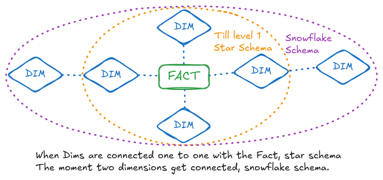

# DATA-MODELLING

#### ACID
> ACID solves the problem of data integrity and reliability in OLTP (Online Transaction Processing) systems, where multiple users or processes can read and write simultaneously. It prevents issues like lost updates, dirty reads, phantom reads, and partial writes.
- Atomicity - Atomicity ensures that a transaction is “all or nothing.” If any part of the transaction fails, the entire transaction is rolled back.
- Consistency - Consistency ensures that a transaction moves the database from one valid state to another, preserving all predefined rules (e.g., constraints, cascades).
- Isolation - Isolation ensures that concurrently executing transactions do not interfere with each other. Each transaction behaves as if it were the only operation running on the system.
    - Example: When multiple data ingestion pipelines write to the same dimension table, isolation ensures that one pipeline’s uncommitted changes aren’t visible to the other, avoiding dirty reads.
- Durability - Durability guarantees that once a transaction commits, its results persist, even in the event of a system crash.

#### DATABASE
    Made for write heavy operations and hence is row based. OLTP.

#### DATA-WAREHOUSE 
    As the name suggests, warehouse for all types/sources of data stored in structured format. OLAP.    
    - Designed for complex queries
    - ETL process. Read heavy.

#### DATA-LAKE
    Storage repo for all types of raw-data, stored in it's native format
    - ELT process.
    - Cost effective

#### DATA-LAKEHOUSE / OPEN TABLE FORMAT
    Best of both worlds. Aims to provide the reliability, performance of a warehouse while also providing scalability, flexibility, scale and low cost storage of datalakes.
    - HUDI, Iceberg and DeltaLake are open table formats which enable Data Lakehouse architecture.

#### DATAMART(AS A CONCEPT)
    DW contains data from all sources and hence there's a need to seggregate related data together. So DM contains one type of data. Ex- For a retail gaint the sales data
    - Dependent- When it depends on DW
    - InDependent- When it doesn't depend on DW. ID-DM's are sort of same as DW, thin line between them.

#### ARCHITECTURE TYPES
- Lambda- Has different pipeline for Batch and Streaming
- Kappa- Has common pipeline for Batch and Streaming
    - Might have the problem of out of order data, the late data arrival scenario.

#### DATA VAULT MODELING
    Database design technique used to build data warehouses, particularly suited for handling complex data from diverse sources by providing a flexible and scalable way to integrate and store data, emphasizing historical tracking and adaptability to changing business requirements; it utilizes three key entities: 
    - Hubs: representing core business concepts
    - Links: defining relationships between hubs
    - Satellites: storing descriptive information about hubs and links, allowing for easy data lineage and auditability

#### FACT TABLE
    - Measurement
    - Grain- means the level of details
    Three types
        - Additive- Can add the fact along any dimension
        - Non Additive- Cannot
        - Semi Additive- Can but not all
    Also
        - Transaction Fact Table(usual)
        - Periodic Snapshot Fact Table- Snapshot taken in periodic interval
        - Accumulating- When there's a fixed start and end. Data is stored columnwise.
        - Factless Fact Table- When the whole row is a measurement and not just any column. Will contain DIM FK.

#### DIMENSION TABLE
    - Context
    Types-
        - Conformed Dimension- When a dim table is used more than once. Ex- Date dim table.
        - Role Playing Dimension- When a dim table is used as a view in two or more forms i.e., multiple roles. 
        - Junk Dimension- When multiple small dim tables are joined together.

#### DATA-FORMATS
-    AVRO - Binary format that stores both the data and its schema, allowing it to be processed later with different systems without needing the original system's context.
-    Parquet - Columnar storage format optimized for analytics. Allows for efficient compression and encoding schemes.

#### SCD- Slowly Changing Dimension
> Slowly Changing Dimension (SCD), we are referring to how historical data is maintained in a dimension table when changes occur over time.
- SCD0- Contains column like date of joining, which never change, hence a record never changes in this table
- SCD1- Overwrite/Inplace update- Let's say a person changes his city the record would be overwritten
    - Problem would be there's no historical record
    - Since no historical record, if we refresh a back date, we'll get wrong value.
- SCD2- History is retained. Works with Active/Inactive Flag, start_date and end_date.
    - REC1 gets inserted
    - REC1 gets updated → changes the previous record's Flag to Inactive and end_date as current record's start_date - 1
- SCD3- Niche use case, department is splitted, department name changed, product name changed.
    - We introduce a column that contains the prev value, so that we can compare the performance pre and post changes.

#### Data Mesh
Data Mesh advocates a decentralized way of managing data. So basically moving from a monolithic way of keeping data to micro domain based.
Data as a product. More than an a technology its a mindset shift. Serve the data via Data Contract(like API Contract)
Data mesh is a decentralized data architecture that treats data as a product, owned by domain-specific teams who understand it best, supported by a self-serve data platform and governed by a federated group with global standards.


#### GTK(Good To Know)
- Data skew refers to the unequal distribution or imbalance of data across various nodes or partitions in distributed computing systems.
    -   Enable Custom or Adaptive Partitioning 
    -   Add salt(random data) to all data to distribute uniformly   
- DataFormat- Specification of how data is serialized and stored. Ex- Parquet, Avro
- TableFormat- Specification of how entities represented in the data are organized and distributed amongst the files.
- Roll Down- Add details(columns) to the table
- Roll Up- Remove details(columns) from the table
- Business Key- When a key gives information about the business. Ex- SUG2540- Could mean Sugar, 25 Expiry, 40Rs. It may or may not uniquely identify a record
- Surrogate Key- When the business key cannot uniquely identify a record, we introduce a new column which will only contain NUMERIC value. This column is then used as PK and FK in other tables. Since NUMERIC, fast. 
- Rolling Append- Say you can only store 24 months of data, when a new months comes in you'll have to delete the earliest month's data

## DIFFERENCES

#### 🔄 Normalization vs Denormalization
- Normalization: Dividing tables- organizing data to reduce redundancy (common in `OLTP` (Online Transaction Processing)  systems).
- Denormalization: Merging tables to improve query performance (common in `OLAP` (Online Analytical Processing) systems).

#### Normalization Types - 
- 1NF 
    - Table should have primary key and then follow the reqd constraints as per primary key.
    - Using row order to convey information is not permitted. (Ex- name_sorted_on_height)
    - Table cannot contain 2 or more values in a row.

- 2NF
    - Each non-key attributes should be fully dependent on the primary(composite) key so as to prevent update, delete and insert anomaly.
        - Ex- In a table player_id(ck), item_type(ck), items(count), rating. items is dependent on ck but rating is only dependent on player_id.

- 3NF
    - Every non-key attribute should depend on the key, whole key and nothing but the key.
    - There should be no transitive dependency. No non-key attribute should be dependent on another non-key attribute.
        - Ex- In a table player_id(pk), rating, skill_level. It satisfies 2NF but skill level is dependent on the rating. 
        
#### 🔄 Star Schema vs Snowflake Schema
- Star Schema: Fact table at center with denormalized dimension tables.
- Snowflake Schema: Dimension tables are normalized (multiple levels of related tables).
- Trade-off: Star = faster queries, Snowflake = less redundancy, better maintainability.
</br></br>

#### 🔧 ETL vs ELT
- ETL: Transform before loading. Suited for traditional DWs.
- ELT: Load first, transform later (leveraging DW or DL processing power). Common in modern cloud-based tools.

#### 📈 Kimball vs Inmon Methodology
- Kimball: Bottom-up. Build data marts first, integrate later. Star schema focused.
- Inmon: Top-down. Build enterprise DW first. Emphasis on normalized data.

#### 🔑 Surrogate Key vs Natural Key
- Surrogate Key: A system-generated unique identifier.
- Natural Key: A key that has business meaning (from source data)

#### ⚙️ Dimensional Hierarchies
- Helpful for reporting (e.g., Day → Month → Quarter → Year).
- Used in OLAP cubes and BI tools for drill-down analysis.

#### 🧠 Common DW Design Patterns
- Bridge Table: To handle many-to-many relationships (e.g., customer and multiple account reps).
- Mini-Dimension: To isolate volatile attributes (frequently changing ones) from large dimension tables.
- Degenerate Dimension: A dimension attribute stored in the fact table itself (e.g., invoice number).

#### 🧱 Data Contracts
- Agreements on schema and semantics between producers and consumers (useful in microservices or streaming pipelines).


## QnA
1.  What about lakehouse architecture? What are the principles, how do you design?
    ```
    Unified Data Architecture - The fundamental principle is unification - bringing together the low-cost, flexible storage of data lakes with the ACID transactions and schema enforcement of data warehouses. This isn't just about having both systems; it's about creating a single source of truth where all data types coexist seamlessly.
    Separation of Storage and Compute - Independent scaling is crucial. Storage and compute resources must scale independently based on workload demands, not coupled together like traditional warehouses.
    Design Implication: I design for schema-on-read flexibility with optional schema enforcement. This means data can land in raw format, but I can progressively apply structure as business needs evolve.
    ```


### [🛠️ Resource](https://www.youtube.com/watch?v=UiTvqSd52ak&list=PLTsNSGeIpGnGP8A74Ie1PgqHhewsqD3fv)
