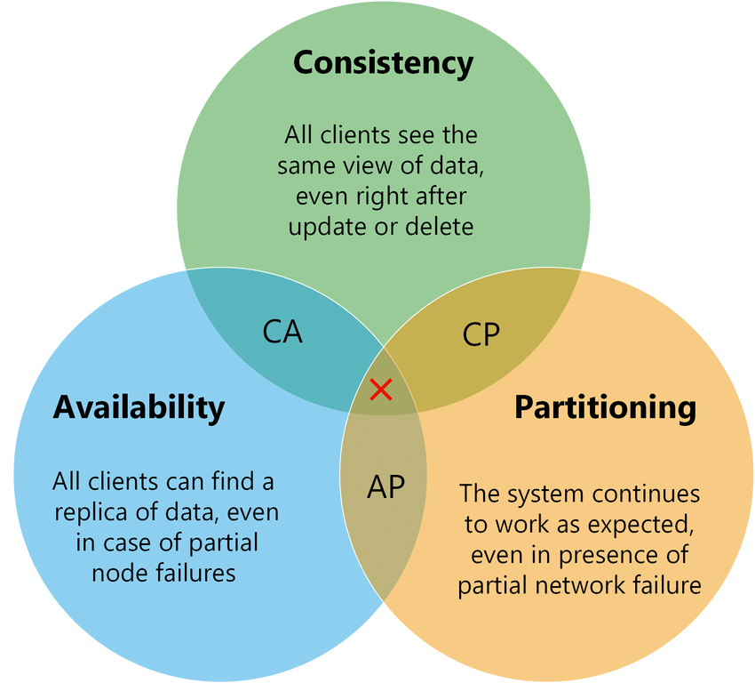
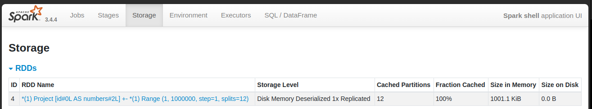

### CAP Theorem
</br>

##### How to check if a dataframe has been cached or not in Spark UI?
</br>


##### What/how to check if a spark job is running slow?
1. Check Executors Tab- Look for high CPU/Memory usage.
2. Check Jobs Tab- Look at the DAG visualization. Are there wide (shuffle-heavy) or deep (many stages) jobs?
3. Check Stages Tab- Look at the shuffle read/write size. Large shuffles slow jobs.

## PARQUET 
Columnar format(best for OLAP, binary file format).
It stores in a hybrid fashion(column in row-wise), i.e., 128MB(default) block worth of data would be stored together. 
Metadata stores min max etc for a particular page(where all data is actually stored).
RLE- Run Length Encoding: aaabbbbbbcd → a3b5cd
Types of compression: [Snappy, GZIP, LZO] in order of speed. Snappy fastest
```
File
    Row Group
        Column
            Pages
                Metadata
                    Min
                    Max
                    Count
```
Supports Predicate Pushdown and Projection Pruning.
Predicate refers to the where/filter clause which affects the amount of rows returned.
Projection refers to the selected columns.


chroot" (short for "change root") is a command-line tool in Unix-like operating systems like Linux that modifies the apparent root directory for a running process and its children

Conflict-free Replicated Data Type (CRDT) is a data structure that simplifies managing data across multiple replicas in a distributed system.
Operational Transformations (OT)
CDN (Content Delivery Network) is a geographically distributed network of servers that are used to store and deliver website content to users.
Exploratory Data Analysis (EDA) is a technique used by data professionals to understand a dataset's structure, relationships between features, and other relevant information. It involves examining data, often through visualization, to identify patterns, anomalies, and outliers, ultimately helping to gain insights and generate hypotheses. 

## DBT
1. Can we exclude a model in dbt?
    > dbt run --exclude model1 model2

2. How to run everything in dbt: test, models, snapshot?
    > dbt build

3. How to run a macro in dbt?
    > dbt run-operation <macro_name>

4. What are artifacts in dbt
    > In dbt, artifacts are JSON files automatically generated by dbt commands that store detailed metadata about your dbt project, its resources, configurations, execution results, and data warehouse state. These artifacts serve as a comprehensive record and provide rich context about the project's structure, runtime, and testing outcomes. They are produced whenever you run dbt commands like dbt run, dbt test, dbt build, or dbt docs generate. <br>
    Artifacts include important JSON files such as:
    - manifest.json: Contains a full representation of the dbt project's Directed Acyclic Graph (DAG), including models, sources, tests, macros, and their relationships.
    - run_results.json: Records execution results of models and tests, including success/failure statuses, runtimes, and errors.
    - catalog.json: Stores metadata about database schemas, such as column types and descriptions, generated by dbt docs generate.
    - sources.json: Contains freshness information of data sources, produced by dbt source freshness.
    - semantic_manifest.json: Used by dbt's semantic layer tools for metrics and modeling.


## QnA

1. What is an open-table format?
    > An open table format is an open-source, standardized metadata layer built on top of raw data file formats (like Parquet or ORC) that stores not only the tabular data but also the metadata about the data and operations separately.

2. Does Iceberg not auto compaction of manifest file?
   > Iceberg does not auto-compact manifest files fully automatically out of the box without any user or system intervention, but it provides APIs and features to rewrite and compact manifest files, which can be run on-demand or integrated into workflows for automatic compaction.

3. Does Iceberg create new data files or are those mutable?
   > Parquet files used by Iceberg are always immutable, and data changes result in new files, not in-place edits.
    In Apache Iceberg, both manifest files and manifest lists are immutable—they are never modified in place.

4. What is thrift server?
   > The Thrift server acts as a bridge between external client applications and the distributed SQL engine

## DSA Related

    LineSweep
    DifferenceArray- When asked to find about updating values in a set interval, find the relative diff between elements, set the num[from] += val and num[to] -= val and then prefix sum.
    When we have to find something between ranges, prefix sum.
    KMP- for prefix and suffix
    Count of each element in subsets of an array = 2**(n-1) where n = len(array)