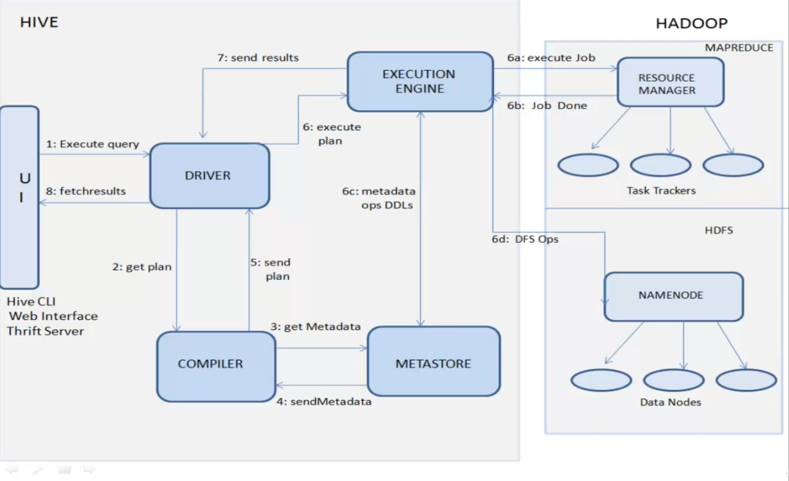

## HIVE
Hive is a query engine that gives us SQL way to write instead of Java. Hive programs are converted to MapReduce programs internally. It is not a database, it just points to the data which is present in HDFS. Loading table here means mapping the schema of the table to HIVE metastore. It is used for batch processing. It is a tool sitting on top of HDFS to query the data as per demand.

#### ARCHITECTURE
 

#### INTERNAL TABLE vs EXTERNAL TABLE
- INTERNAL TABLE- controlled by Hive both metastore and data that is present in HDFS.
- EXTERNAL TABLE- metastore is controlled by HIVE. Deletion of table from HIVE would not mean deletion of table from HDFS. The linkage between the Hive and this table's data is lost.
- EXTRAS- by default the data is present in `user/hive/warehouse`. This directory is fully controlled by HIVE

#### ORDER BY vs SORT BY vs DISTRIBUTE BY
- ORDER BY works in one reducer and hence we may get out of memory error, best to use a LIMIT clause.
- SORT BY works with multiple reducers, the catch being the output would be ordered for each reducer and not as a whole.
- DISTRIBUTE BY ensures non-overlapping values for all the reducers(R1- 1,3,5 | R2- 2,7,8)

#### PARTITIONING
- STATIC- We need to create everything, load data in correct partitions. Only + being it's fast since it knows everything pre-hand.
- DYNAMIC- need to enable. Need to specify the column and then done.
- FAQ- What if you delete one parition? You can add the partition manually or run `MSCK REPAIR TABLE table_name`, this would add the partition. Partition is a directory.

#### BUCKETING
- Bucketing is a file. Each bucket inside a partition contains same values. By default not enabled. We can specify the number of buckets in a partition. Buckets = Reduce Tasks.

By default, the last table of join is streamed and others are buffered in the memory.
Speculative Execution- When a task takes time the RM(Resource Manager) spins off another mapper in a different node the data exists.

    Block may not = Split(logical)
    But Split = Mapper Number

Job Tracker = Resource Manager
Task Tracker = Node Manager

### [🛠️ Resource](https://www.udemy.com/course/hadoop-querying-tool-hive-to-advance-hivereal-time-usage/)
