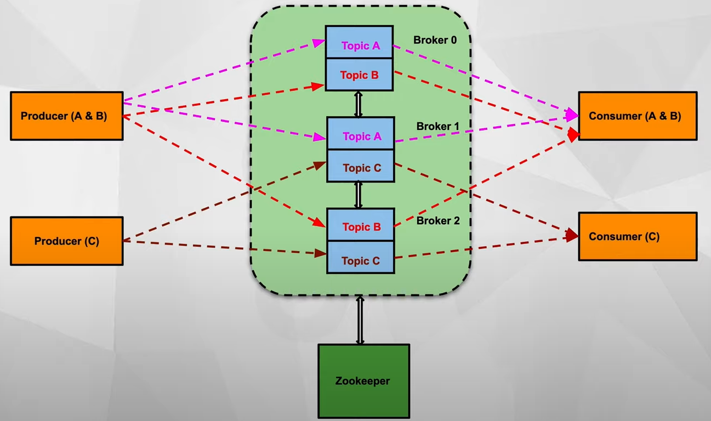

## KAFKA

#### Kafka is a distributed streaming messaging platform.
</br>

## ABOUT
- A message consists of key-value pair and metadata(headers, timestamp, topic name, partition number), which is identified by offset number.
- We can specify number of brokers, partitions, replication factor and retention period.
- Producers write to just one parition, the rest partitions follow/sync by inter-broker communication.
- `Replica ID` : same a Broker ID.
- `Broker` : nothing but kafka server application running on host machine, broker = node.
- `Controller` : one broker elected by Zookeeper to administer the partitions, whether it is online/offline etc.
- `Zookeeper` : application running outside the kafka cluster, tracks the brokers and contains metadata information like ACL. 
- `ACL - Access Control List` : which producer has access to which topic
- Consumer Group- Used to identify an application from a topic
    - Suppose Consumer-Group-C1 subscribes to two topics and each topics has 5 partitions then the number of consumers should be <= total number of partitions(10)
    - If there's Consumer-Group-C2, same rule applies.
    - So practically we can have `N` different `consumers` reading the same partition.

## SSL
>Out of the box, Producers and Consumers can connect and send messages in a topic in plain-text, to overcome this issue we use SSL(Secure Socket Layer) or TLS(>>Transport Layer Security).<br>
>SSL Handshake- When only server authenticates, when both authenticate- two way.

### SSL Analogy
>CLIENT-- Person- wants to go to US.<br>
>CA(CERTIFICATE AUTHORITY)-- USEI(US Embassy India)- Issues a VISA <br>
>TS(TRUST STORE)-- Archive of all the certificate issuers<br>
>SERVER-- US Airport- Checks in TS whether USEI is authorized to give VISA

## SASL
>To simplify authentication from client side we use SASL(Simple Authentication and Security Layer) authentication instead of SSL<br>
>SASL_SSL- Authentication by SASL and communication by SSL.<br>
>Server-Client(Broker-Producer)- Producer tries to connect with the Broker using its username password, then the Broker would expose it's keystore and SASL would check in Producer would check in its trust store if the key is present

## ACKNOWLEDGEMENT LEVELS (acks)
Producer can specify how much durability they need:
- acks=0 → fire-and-forget (not durable)
- acks=1 → leader confirms write
- acks=all / -1 → leader + all in-sync replicas confirm the write (most resilient)
>With acks=all, data is only considered written when fully replicated.

## NOTES
- Default `replication` of `3` factor causes issue in local machine.
- Default `Encryption`- `PLAINTEXT`.
- Default `retention`- `7 days/1GB`.
- Brokers also known as bootstrap servers.
- No of zookeeper suggested is 5 and shouldn't be more than 7 as performance takes a hit.
- Expansions can be performed while the cluster is online, with no impact on the availability of the system as a whole.
- The replication mechanisms within the Kafka clusters are designed only to work within a single cluster, not between multiple clusters.
- Topics can also be configured as log compacted, which means that Kafka will retain only the last message produced with a specific key. This can be useful for changelog-type data, where only the last update is interesting.
- The Kafka project includes a tool called MirrorMaker, used for this purpose. At its core, MirrorMaker is simply a Kafka consumer and producer, linked together with a queue. Messages are consumed from one Kafka cluster and produced for another.
- Kafka tracks consumer progress by storing offsets inside a replicated internal topic (`__consumer_offsets`), and consumers commit new offsets periodically or after processing, so they can resume from the exact position after restarts or failures.
## KAFKA COMMANDS
```shell
kafka-topics --list --bootstrap-server localhost:29092
kafka-topics --create --topic device-data --bootstrap-server localhost:29092
kafka-console-consumer --topic test-topic --from-beginning --bootstrap-server localhost:9092 --group ""
kafka-console-producer --topic device-data --bootstrap-server localhost:29092
```

### [🛠️ Resource](https://youtube.com/playlist?list=PLlBQ_B5-H_xhEHUC6OWI0eide_4wbt8Eo&si=uSKW9vEHXC_QNueu)